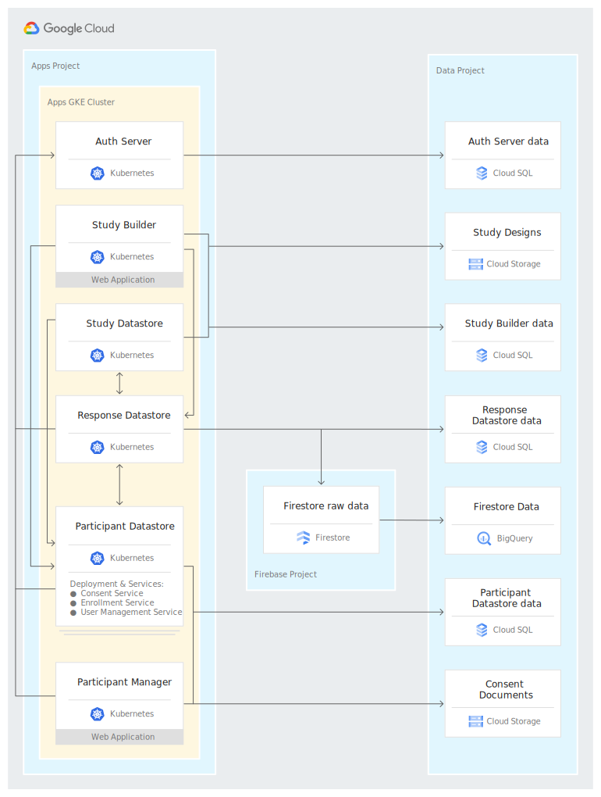

<!--
 Copyright 2020 Google LLC
 Use of this source code is governed by an MIT-style
 license that can be found in the LICENSE file or at
 https://opensource.org/licenses/MIT.
-->

 

## Overview

The FDA’s MyStudies platform enables organizations to quickly build and deploy studies that interact with participants through purpose-built apps on iOS and Android. MyStudies apps can be distributed to participants privately or made available through the App Store and Google Play.

This open-source repository contains the code necessary to run a complete FDA MyStudies instance, inclusive of all web and mobile applications.

Open-source [deployment tools](deployment) are included for semi-automated deployment to Google Cloud Platform (GCP). These tools can be used to deploy the FDA MyStudies platform in just a few hours. These tools follow compliance guidelines to simplify the end-to-end compliance journey. Deployment to other platforms and on-premise systems can be performed manually.

To receive release notifications and other important announcements related to the repository, subscribe to [mystudies-announce@googlegroups.com](https://groups.google.com/g/mystudies-announce/).

## Documentation and guides

Information related to the deployment and operation of FDA Mystudies can be found within each directory’s `README`, and also in the following guides:

<!--TODO * [Feature and functionality demonstrations](documentation/demo.md)-->
* [Detailed platform overview](documentation/architecture.md)
* [Instructions for semi-automated deployment](deployment/README.md)
<!-- TODO
* User guides study builder, participant manager and mobile applications(documentation/user-guides.md)
* API reference(documentation/api-reference.md)
-->

For the complete list of FDA MyStudies documentation, visit [`documentation/README.md`](/documentation/README.md). 

## Platform components and repo organization

Component | Intended users | Purpose | Directories
----------------|----------------------|------------|----------------
Study builder | Researchers and clinicians | No-code user interface for authoring studies ([demo screens](documentation/images/study-builder-screens.png)) | [`study-builder/`](study-builder/) [`study-datastore/`](study-datastore/)
Participant manager | Study coordinators | No-code user interface to manage participant enrollment ([demo screens](documentation/images/participant-manager-screens.png)) | [`participant-manager/`](participant-manager/) [`participant-manager-datastore/`](participant-manager-datastore/)
Mobile applications | Study participants | Apps to discover, enroll and participate in studies ([demo screens](documentation/images/mobile-screens.png)) | [`iOS/`](iOS/) [`Android/`](Android/)
Response datastore | Researchers and analysts | Collects and stores participant response data for downstream analysis | [`response-datastore/`](response-datastore/)
Participant datastore |  | Manages participant data such as contact information and consent forms | [`participant-datastore/`](participant-datastore/)
Auth |  | Manages account creation, login, logout and resource requests | [`hydra/`](/hydra/) [`auth-server/`](/auth-server/)
Deployment | System administrators | Infrastructure-as-code to build and maintain platform | [`deployment/`](deployment/)

Each high-level directory contains a `README.md` and the necessary deployment configuration files.

For more information about the platform architecture, visit the [Platform overview](documentation/architecture.md). An example of how this architecture can be deployed on Google Cloud is diagrammed below.

## Data and compliance

FDA MyStudies is designed so that all data stays within the deploying organization’s environment (unless that organization chooses to export their data). Any identifiable data is stored separately from study and response data to help organizations minimize access to sensitive data.

The FDA MyStudies platform has been designed to support auditing requirements for compliance with 21 CFR Part 11, allowing the platform to be used for trials under Investigational New Drug (IND) oversight. If an organization chooses to run FDA MyStudies on Google Cloud, a variety of infrastructure options are available that support HIPAA and other compliance requirements. More information about compliance on Google Cloud and an up-to-date list of products covered under BAA can be found [here](https://cloud.google.com/security/compliance/hipaa/).

In addition to the platform itself, the open-source [deployment tools](deployment) are designed to assist organizations with their end-to-end compliance journey. Although achieving compliance is the responsibility of the deploying organization, these toolkits enable organizations to deploy FDA MyStudies in a way that helps meet compliance requirements. More details of the deployment patterns used by these automation tools can be found [here](https://cloud.google.com/solutions/architecture-hipaa-aligned-project). 

Google Cloud can support compliance with 21 CFR Part 11 regulations when using GCP services in a prescribed manner to handle related data and workloads. While Google has a cloud technology stack ready for many 21 CFR Part 11 compliant workloads, the ultimate compliance determination depends on configuration choices made by the deploying organization.

## Release notes

For a detailed list of changes to the FDA MyStudies codebase, see *[What’s new](/documentation/whats-new.md)*.

Subscribe to [mystudies-announce@googlegroups.com](https://groups.google.com/g/mystudies-announce/) to receive release notifications and other important announcements related to the repository.

## Feedback

Feature requests and bug reports should be submitted as [Github Issues](https://github.com/GoogleCloudPlatform/fda-mystudies/issues/new/choose). All feedback is greatly appreciated.

***

Copyright 2020 Google LLC

